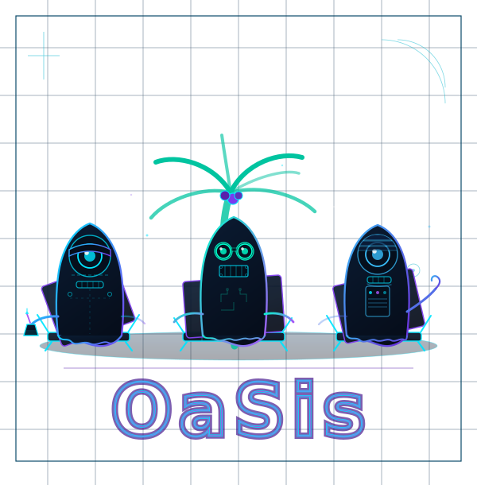

<p align="center">
  <strong>Your vibe coded apps and agents need a homescreen</strong> <br>
  A personalized place for everything you build <br>
  Curate your own personal OaSis to suit your vibe
  <br>
  <br>
  
</p>

---

**OaSis** is a self-hosted dashboard that discovers, organizes, and exposes your locally-running apps and AI agents exclusively over your [Tailscale](https://tailscale.com) network. One Docker container, no accounts, no open ports — your personal homescreen, accessible from any device on your tailnet.

Install the dashboard as a **Progressive Web App** on any phone or tablet on your tailnet and it launches in full-screen standalone mode, just like a native app. See [Installing OaSis as an App](docs/pwa.md) for iOS and Android instructions.

> **Status:** This repository is under active development. The CLI, controller scaffold, and initial webapp dashboard are in place; full end-to-end wiring and browser integration tests are planned in upcoming work items.

---

## Contents

- [How it works](#how-it-works)
- [Prerequisites](#prerequisites)
- [User quickstart](#user-quickstart)
- [Developer quickstart](#developer-quickstart)
- [Repository structure](#repository-structure)
- [Build targets](#build-targets)
- [Environment variables](#environment-variables)
- [Installing as an app (PWA)](docs/pwa.md)
- [Contributing](#contributing)

---

## How it works

```
[oasis CLI]  ──HTTP──▶  [127.0.0.1:04515 Management API]
                                  │
                          [Controller (Go)]
                          ╱        │         ╲
                    [SQLite]    [tsnet]   [crossplane-go]
                                  │              │
                            [Tailscale]     [NGINX reload]
                                  │              │
                     [Tailnet browser]   [Registered app upstreams]
```

- The **controller** runs inside a single Docker container alongside NGINX and the pre-built Next.js webapp.
- The **management API** is bound to `127.0.0.1` only — never reachable from the network.
- The **oasis CLI** lives on your host machine and talks to the controller over localhost.
- The **dashboard** is served by NGINX over your Tailscale network (tsnet) with automatic TLS — no configuration required.

---

## Prerequisites

### To use oasis (end users)

| Requirement | Notes |
|---|---|
| Docker | Docker Desktop (macOS/Windows) or Docker Engine (Linux) |
| Tailscale account | Free; needed to generate an auth key |

No root/sudo required. On Linux, your user must be in the `docker` group.

### To develop oasis (contributors)

| Requirement | Version | Notes |
|---|---|---|
| Go | 1.22+ | `go version` |
| Node.js | 20+ | `node --version` |
| npm | 10+ | Bundled with Node.js 20 |
| Docker | Any recent | Required for `make test-integration` and `make build-docker` |
| make | Any | Standard on macOS/Linux |

---

## User quickstart

> **Note:** The Docker image is not yet published. This section reflects the intended end-user experience once releases are available.

```sh
# 1. Install the oasis CLI
brew install [owner]/tap/oasis          # macOS / Linux via Homebrew
# or: download the binary from GitHub releases and place in /usr/local/bin/oasis

# 2. Run first-time setup
oasis init
#   → prompts for your Tailscale auth key (get one at login.tailscale.com/admin/settings/keys)
#   → prompts for a Tailscale hostname (default: oasis)
#   → pulls the Docker image, starts the container
#   → prints your dashboard URL when ready

# 3. Register your first app
oasis app add --name "My App" --url http://localhost:3000 --slug myapp

# 4. Check status
oasis status
```

Your dashboard is now accessible at `https://oasis.[tailnet-name].ts.net` from any device on your tailnet.

---

## Developer quickstart

```sh
# Clone
git clone https://github.com/[owner]/oasis.git
cd oasis

# Install dev tooling (air for live reload, golangci-lint)
make install-tools

# Copy and configure local environment
cp .env.local.example .env.local
# Edit .env.local and fill in TS_AUTHKEY with a dev Tailscale auth key

# Start controller (with live reload) + Next.js dev server in parallel
make dev
#   Controller: http://127.0.0.1:04515
#   Webapp:     http://localhost:3000
```

### Build

```sh
make build          # builds ./bin/controller and ./bin/oasis
make build-cli      # builds ./bin/oasis only
```

Version is embedded at build time from `git describe --tags --always`. Development builds use `version=dev`.

### Test

```sh
make test           # go test -race ./... + npm test --ci
```

### Lint

```sh
make lint           # golangci-lint run ./... + tsc --noEmit + next lint
```

### Integration tests

```sh
make test-integration   # docker compose -f docker-compose.dev.yml up
```

> Integration tests require Docker and a real Tailscale auth key in `.env.local`.
> The integration test suite is a stub in the current version — it will be wired up in a future work item.

### Docker image

```sh
make build-docker   # builds the multi-stage image locally (no push)
```

---

## Repository structure

```
cmd/
  controller/         # Controller binary entry point
  oasis/              # CLI binary entry point
internal/
  controller/
    api/              # Management API handlers (stub)
    db/               # SQLite store (stub)
    nginx/            # NGINX config generation (stub)
    tsnet/            # Tailscale tsnet integration (stub)
  cli/
    root.go           # Cobra root command + global flags
    init.go           # `oasis init` interactive setup wizard
    container.go      # start, stop, restart, status, update, logs commands
    app.go            # `oasis app` subcommand group
    settings.go       # `oasis settings` subcommand group
    db.go             # `oasis db` subcommand group
    config/           # CLI config (~/.oasis/config.json) load/save
    client/           # HTTP client for the management API
    docker/           # Docker CLI wrapper (pull, run, start, stop, logs, …)
    table/            # Output formatting: tables, key/value lists, spinner
webapp/               # Next.js App Router (static export)
  app/                # Root page, layout, and global styles
  components/         # AppIcon, BottomNav, EmptyState, HomescreenLayout, TimeOfDayBackground + shadcn/ui primitives
  lib/                # Typed API fetch helpers (api.ts) and shared utilities
  __tests__/          # Jest unit tests
.github/workflows/
  ci.yml              # Lint + test + build on every push/PR
  release.yml         # Multi-arch Docker image + CLI binaries on semver tag
Dockerfile            # Multi-stage: node:20-alpine → golang:1.22-alpine → debian:bookworm-slim
Makefile              # All build/dev/test/lint targets
.env.local.example    # Canonical list of environment variables
aspec/                # Living design specification — source of truth
```

---

## Build targets

| Target | Description |
|---|---|
| `make install-tools` | Install `air` (live reload) and `golangci-lint` into `$GOPATH/bin` |
| `make dev` | Start controller with live reload + Next.js dev server (parallel) |
| `make build` | Build webapp static export + `./bin/controller` + `./bin/oasis` |
| `make build-webapp` | Build the Next.js static export to `dist/webapp/` only |
| `make build-cli` | Build `./bin/oasis` only |
| `make generate-icons` | Regenerate PWA icon PNGs from `webapp/public/icons/icon.svg` |
| `make test` | Go unit tests (race detector) + Jest unit tests |
| `make lint` | golangci-lint + TypeScript type check + Next.js lint |
| `make test-integration` | Full integration test suite via Docker Compose |
| `make build-docker` | Build Docker image locally (runs `generate-icons` first) |

---

## Environment variables

All variables are documented in `.env.local.example`. Copy that file to `.env.local` for local development — it is git-ignored and must never be committed.

| Variable | Default | Description |
|---|---|---|
| `TS_AUTHKEY` | — | Tailscale auth key (first start only; not needed after tsnet state is persisted) |
| `OASIS_MGMT_PORT` | `04515` | Management API port (published loopback-only: `127.0.0.1:PORT`) |
| `OASIS_HOSTNAME` | `oasis` | Tailscale node hostname |
| `OASIS_DB_PATH` | `/data/db/oasis.db` | SQLite database path inside the container |
| `OASIS_TS_STATE_DIR` | `/data/ts-state` | Tailscale tsnet state directory inside the container |
| `OASIS_LOG_LEVEL` | `info` | Log verbosity: `info` \| `debug` \| `warn` \| `error` |
| `NEXT_PUBLIC_API_BASE_URL` | `` (same origin) | Base URL for controller API calls from the webapp. Leave empty in production (NGINX serves both); set to `http://localhost:04515` for local dev. |

---

## Contributing

### Branch workflow

```sh
git checkout -b feat/your-feature
# make changes
git commit -m "feat: add your feature"
git push origin feat/your-feature
# open a pull request — CI must pass before merge
# PRs are squash-merged to keep history clean
```

### Commit convention

This project uses [Conventional Commits](https://www.conventionalcommits.org/) for automated changelog generation:

| Prefix | When to use |
|---|---|
| `feat:` | New user-facing feature |
| `fix:` | Bug fix |
| `chore:` | Tooling, deps, config — no production code change |
| `docs:` | Documentation only |
| `test:` | Tests only |
| `refactor:` | Code restructure with no behaviour change |

### CI pipeline

Every push and pull request runs:

1. **lint-go** — `golangci-lint run ./...` + `go vet ./...`
2. **lint-web** — `tsc --noEmit` + `next lint`
3. **test-go** — `go test -race ./...` with coverage report
4. **test-web** — `jest --ci --coverage`
5. **build** — Go binaries (static linkage verified) + Next.js static export + Docker image

All jobs must pass before a PR can be merged.

### Go module path

The module path is `github.com/[owner]/oasis` — update `[owner]` in `go.mod` to the actual GitHub org/user before the first tagged release.

### Security invariants

These must never be broken:

- The management API binds exclusively to `127.0.0.1` — asserted in unit tests
- `TS_AUTHKEY` is never logged or returned in API responses
- All container processes run as uid 1000 (non-root)
- Go binaries are compiled with `CGO_ENABLED=0` (static, no libc dependency)
- NGINX configuration is reloaded with `SIGHUP` — never a process restart

---

*Built with Go, Next.js, Tailscale, and good vibes.*
