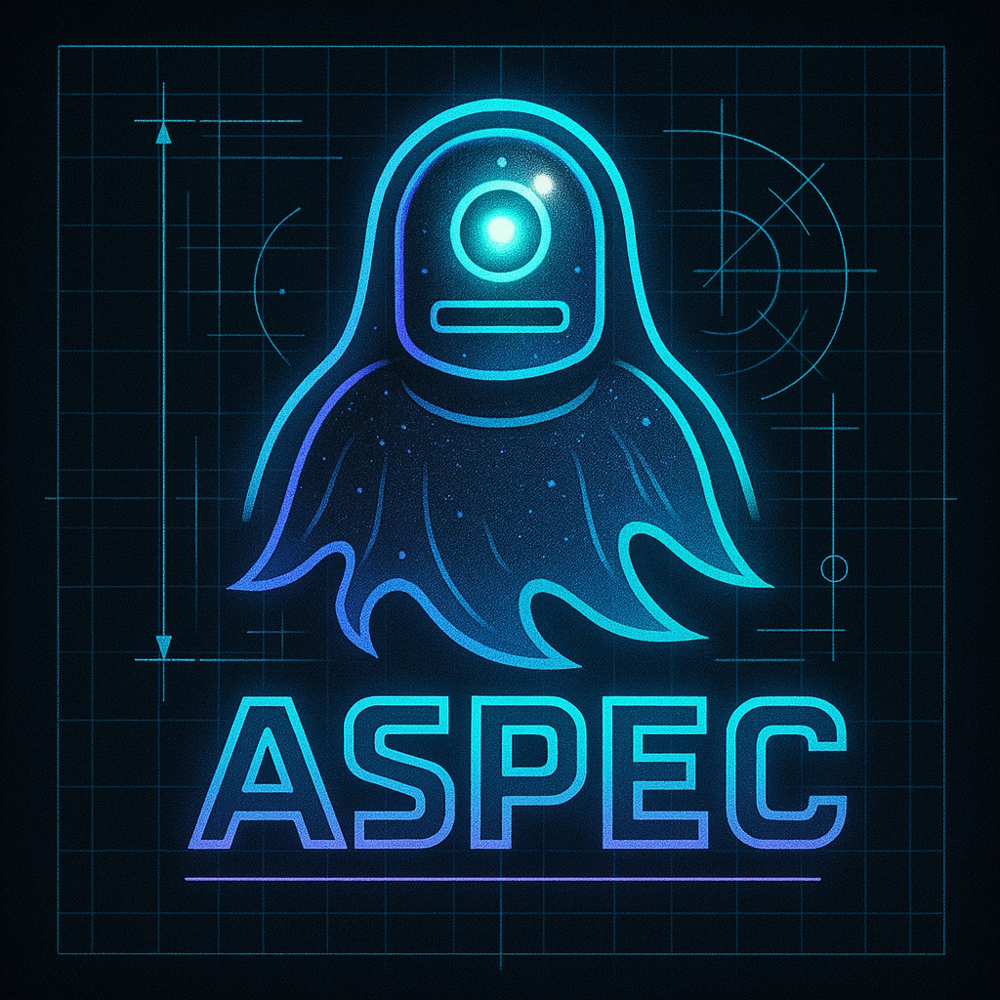

  <strong>Secure, Predictable Agentic Development</strong>  
  Run agents inside containers, never on your machine.  
  Use structured Markdown specifications to guide agents for predictable results.
   
   
  

---

## aspec for spec-driven agentic development
This project is a set of Markdown templates that can be used with a variety of agentic coding tools to create a predictable development workflow. You can co-work with your code agent, using your project's aspec as detailed context, to create quality code more reliably.

There is an optional [aspec CLI](https://github.com/cohix/aspec-cli) which helps automate spec-driven workflows and secures agentic coding tools using containers automatically. With or without the CLI, aspec is meant to be a starting point to reduce the initial toil required to bootstrap a generative AI co-authored project.

Use this repo as a starting point for spec-driven best practices, and then use your agentic tool of choice to begin building code. All specs are contained within the `aspec` folder, and can be referenced individually or as a collective to help AI build predictable code.

## How to use it
Use this repository as a template when creating a new project, or copy the `aspec` folder into an existing project. You can work directly with your agent of choice using the example prompts below, or use the [CLI](https://github.com/cohix/aspec-cli) to automate and secure the workflow further.

Initial setup involves reviewing `foundation.md` and the `devops` and `architecture` folders to fill in your project's specific information and guidance. Then, prompt your code agent to set up the project.

Example prompt:
> Bootstrap the project as defined in the `aspec`. Seed the initial codebase skeleton, set up the local development and CI/CD workflows described, and ensure the basic codebase can be built and run, iteratively fixing any issues that come up.

After initial setup, and after each update to your project's aspec, prompt your code agent to update their own project configuration (such as CLAUDE.md etc.). 

Example prompt:
> Review the `aspec` folder and configure CLAUDE.md along with the .claude directory to conform to its specifications. The `aspec` folder is the only source of truth for this project going forwards, and every task should follow its guidelines. 

Next, review the `uxui` and `genai` folders to customize for your project further.

The reccomended daily workflow involves creating a new file in the `work-items` folder from `0000-template.md`. Use work items as specs for specific features, bugs, or other development tasks you wish to collaborate with your agent on.

For new work items, simply complete the spec and then ask your agent to implement the work item.

Example prompt:
> Implement work item 1234. Once complete, implement its reccomended test plan and build all project components. Iteratively fix all build and test issues until all components build successfully and pass all tests.

Eventually, you will want to review `devops/operations.md` to ensure the application can be deployed and run as desired.

Happy prompting!