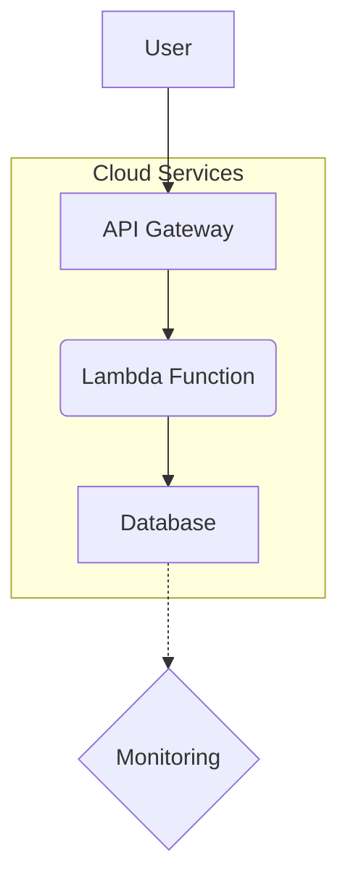

# Project Architecture

Pattern: [monolith | microservices | pipeline]

## Design Principles

### Principle 1
Description:
- description
Reasoning:
- reasoning

### Principle 2
Description:
- description
Reasoning:
- reasoning

## High-level Architecture:

## Major Components

### Component 1:
Name: name
Purpose: purpose
Description and Scope:
- description
- scope

### Component 2:
Name: name
Purpose: purpose
Description and Scope:
- description
- scope