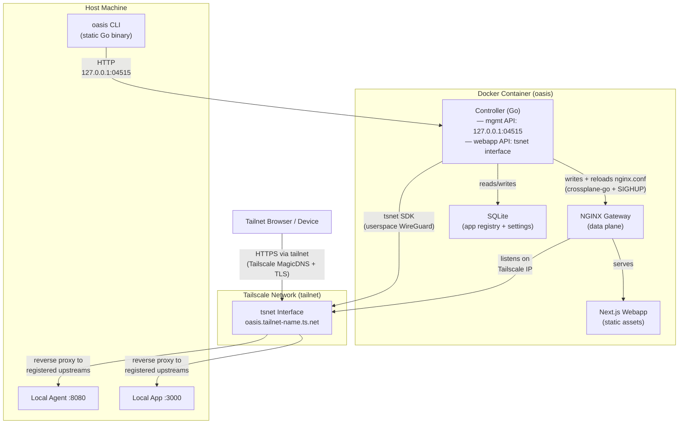

# Project Architecture

Pattern: modular monolith (all components ship in a single Docker container; logical separation between webapp, controller, and gateway)

## Design Principles

### Single Container, Single Node
Description:
- The entire oasis stack (controller, NGINX, Next.js static assets) ships and runs as a single Docker container
- One `docker run` (or `oasis init`) is the complete installation
Reasoning:
- Minimizes operational complexity for self-hosted users with no DevOps experience
- All inter-process communication is local (Unix sockets or localhost); no network hops between components

### Tailscale as the Security Perimeter
Description:
- The webapp and all user-facing APIs are exposed exclusively via the tsnet Tailscale interface
- Nothing is bound to the host's public or LAN network interfaces
Reasoning:
- Delegates authentication and network-level access control entirely to Tailscale
- No passwords, OAuth flows, or session management required; users get device-level auth automatically
- Tailscale ACLs give users fine-grained control over who on their tailnet can reach oasis

### Local-Only Management Plane
Description:
- The controller's management API listens only on 127.0.0.1; the oasis CLI connects from the same host
- No management functionality is exposed over the tailnet
Reasoning:
- Keeps administrative actions (registering apps, changing settings) privileged to the host machine
- Prevents remote management even from trusted tailnet devices — only the machine running oasis can manage it

### NGINX as the Configurable Data Plane
Description:
- The controller dynamically generates and hot-reloads NGINX configuration using crossplane-go whenever the app registry changes
- The controller does not implement proxying itself
Reasoning:
- NGINX provides battle-tested reverse proxy capabilities with graceful reload support
- crossplane-go generates safe, validated NGINX config programmatically with no string templating

## High-level Architecture:

## Major Components

### Component 1:
Name: Controller
Purpose: The brain of oasis — manages the app registry, generates NGINX config, and maintains the Tailscale connection
Description and Scope:
- Written in Go; runs as the primary process inside the Docker container
- Maintains a SQLite database of registered apps/agents: id, name, slug, upstreamURL, displayName, description, icon, tags, enabled, health
- Uses tsnet to join the user's tailnet as the "oasis" node and obtain a Tailscale-issued TLS certificate
- Generates NGINX configuration using crossplane-go and signals NGINX to gracefully reload (SIGHUP) on changes
- Exposes a local-only HTTP management API on 127.0.0.1 for the oasis CLI
- Exposes an internal HTTP API on the tsnet interface for the Next.js webapp to fetch registry data
- Runs a background health-check loop that pings each registered app's upstream and updates its status

### Component 2:
Name: NGINX Gateway
Purpose: The data plane — routes incoming tailnet traffic to the webapp or to registered local apps/agents
Description and Scope:
- Configured entirely by the controller via crossplane-go; no manual NGINX config needed
- Listens on the Tailscale interface IP (provided by tsnet)
- Serves the pre-built Next.js webapp static assets for the dashboard root
- Proxies path-based routes (e.g. /apps/myapp/) or subdomain routes to registered upstream addresses on the host
- Supports graceful config reload without dropping active connections

### Component 3:
Name: Next.js Webapp
Purpose: The user-facing dashboard — displays registered apps and agents and provides navigation
Description and Scope:
- Built with Next.js (App Router) and TypeScript; compiled to a fully static export at Docker image build time
- Fetches app registry data from the controller's tsnet-facing API at runtime
- Displays app icons: name, icon, status indicator, tap to open app inline
- No Next.js server runtime inside the container; pure static HTML/CSS/JS served by NGINX
- `next.config.js` must set `output: 'export'` and `distDir: '../dist/webapp'`; the Dockerfile copies from that path — these two must always be kept in sync

### Component 4:
Name: oasis CLI
Purpose: The management interface — allows the owner to control oasis from their host machine terminal
Description and Scope:
- Written in Go; compiled to a single static binary named `oasis`, installed on the host (not in the container)
- Communicates with the controller's local management API over 127.0.0.1:04515
- Commands cover: initialization, container lifecycle, app registration/listing/removal, settings, logs, updates, and database backup
- Reads its own config from ~/.oasis/config.json (management API endpoint, container name, etc.)
